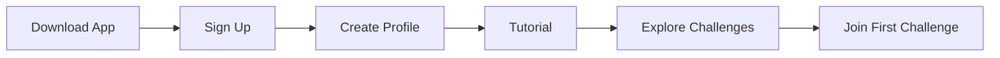
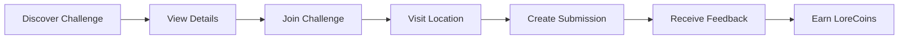
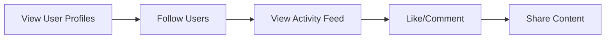
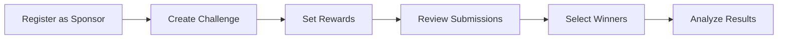

# User Journeys

This section documents the various user journeys and flows within the LorePin application.

## Contents

- [User Journey Map](./user-journey-map.md) - Overview of all user journeys
- [Application Usage Journey](./application-usage-journey.md) - General application usage flows
- [Membership User Journey](./membership-user-journey.md) - User registration and membership flows
- [Authentication Flow](./auth-flow.md) - Detailed authentication processes

## Key User Personas

### Regular Users

- **New Users**: First-time users exploring the platform
- **Active Participants**: Users actively participating in challenges
- **Content Creators**: Users who frequently submit high-quality content
- **Social Users**: Users who focus on social interactions and following others

### Sponsors

- **Local Businesses**: Small businesses creating location-based challenges
- **Brand Sponsors**: Larger brands running marketing campaigns
- **Event Organizers**: Creating challenges tied to specific events

### Administrators

- **Content Moderators**: Reviewing and approving submissions
- **System Administrators**: Managing the platform and user accounts

## Core User Journeys

### 1. New User Onboarding

### 2. Challenge Participation

### 3. Social Interaction

### 4. Sponsor Journey

## User Experience Principles

1. **Simplicity**: Keep user flows intuitive and straightforward
2. **Feedback**: Provide clear feedback for all user actions
3. **Engagement**: Create engaging experiences that encourage participation
4. **Reward**: Properly reward users for their contributions
5. **Community**: Foster a sense of community and social interaction

## Measuring User Journey Success

We track the following metrics to evaluate user journey effectiveness:

- **Conversion Rate**: Percentage of users completing each journey
- **Time to Complete**: Average time to complete each journey
- **Drop-off Points**: Where users abandon journeys
- **Satisfaction**: User feedback and ratings
- **Retention**: Return rate after completing journeys 