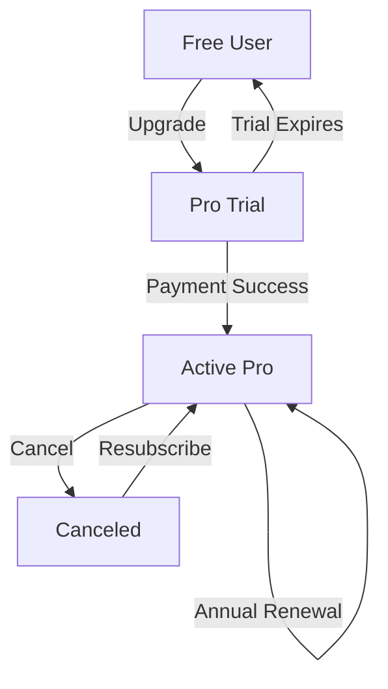

# LorePin Membership User Journey & Process Documentation

## **Objective**
Define the end-to-end experience for free and premium (**Pro**) members, including onboarding, engagement, retention, and cancellation.

---

## **1. Membership Tiers & Benefits**

| Feature | Free Tier | Pro Membership (£8/month) |
|---------|----------|--------------------------|
| **Access** | Basic challenges, voting | All challenges + exclusive AR filters |
| **Rewards** | LoreCoins (capped) | 2x LoreCoins, NFT airdrops |
| **Analytics** | Basic stats (views/likes) | Advanced metrics (ROI, audience demos) |
| **Content** | Ad-supported | Ad-free, early access to features |
| **Support** | Community forum | Priority 24/7 chat + monthly 1:1 coach |
| **Community** | Public leaderboards | Private creator circles, VIP events |

---

## **2. Membership User Journey**

### **Phase 1: Discovery & Consideration**
#### **Entry Points:**
- **In-App Prompt:** “Unlock 2x Rewards & AR Filters → Try Pro Free for 7 Days” _(after 3 submissions)_
- **Email Campaign:** “Exclusive Offer: Go Pro & Earn £100+/Month” _(sent to top 10% of free users)_
- **Challenge Wall:** Pro-only challenges greyed out with CTA _(“Upgrade to Join”)_

#### **Decision-Making:**
- **Compare Plans:** Side-by-side table in _Settings → Membership_
- **Testimonial Carousel:** _“Pro helped me earn £500 in 2 weeks!” – @UrbanExplorer_

---

### **Phase 2: Sign-Up & Onboarding**
#### **Subscription Flow:**
1. Choose plan _(Monthly: £8, Annual: £80 → “Save 15%”)_
2. Enter payment details _(Stripe integration; Apple/Google Pay supported)_
3. Confirm → Welcome screen with confetti animation

#### **Onboarding:**
- **Welcome Email:**
  - Pro benefits summary
  - Link to **“Pro Starter Kit”** _(video tutorials, challenge templates)_
- **In-App Guide:**
  - Interactive tour of Pro features _(e.g., “Try your new AR filter!”)_
  - First Pro challenge unlocked: _“Earn 100 Bonus Coins”_

---

### **Phase 3: Active Membership Engagement**
#### **Exclusive Features:**
- **Pro Dashboard:**
  - **Earnings Tracker:** Projects monthly income based on activity
  - **Sponsor Matchmaker:** AI recommends brands aligned with niche
  - **AR Studio:** Advanced filters _(e.g., “Time Travel” overlay for historical sites)_

#### **Retention Tactics:**
- **Weekly Pro Digest:**
  - Personalized challenge suggestions
  - “You’re 50 coins away from a free museum pass!”
- **Milestone Rewards:**
  - **1 Month:** Custom NFT badge
  - **3 Months:** Free month + feature on LorePin’s blog

#### **Community Building:**
- **Pro-Only Events:**
  - **Monthly Masterclass:** _“Grow Your Audience with AR Storytelling”_
  - **Virtual Meetups:** Network with top creators and sponsors

---

### **Phase 4: Renewal & Cancellation**
#### **Renewal Process:**
- **Reminders:**
  - _7 days pre-renewal:_ “Your Pro perks renew on [date]. Keep earning?”
  - _24 hours pre-renewal:_ Push notification + email
- **Loyalty Incentives:**
  - Annual subscribers get a **“Pro Mentor Session”** _(1-hour strategy call)_

#### **Cancellation Flow:**
- **Self-Service:**
  - _Settings → Membership → Cancel_
  - Exit survey _(“Why are you leaving?” with options: Cost, lack of value, etc.)_
- **Win-Back Offers:**
  - _“Stay for £5/month next 3 months →”_ _(if cancelling due to cost)_
- **Grace Period:**
  - Pro features remain active until billing cycle ends

---

## **3. Technical Specifications**

### **3.1 Payment & Subscription Management**
- **Payment Gateway:** Stripe _(PCI-DSS compliant)_

#### **Key Endpoints:**
```http
POST /api/subscribe  # Handles plan selection and payment
GET /api/invoices    # Fetches billing history
PUT /api/cancel      # Cancels subscription (triggers prorated refund if annual)
```

#### **Webhooks:**
- **invoice.paid** → Grants Pro access
- **invoice.payment_failed** → Retries payment ×3 → Downgrades to Free if failed

---

### **3.2 Data Models**
```javascript
// Firestore Collections
// Users
{  
  userId: string,  
  membership: {  
    tier: "free" | "pro",  
    status: "active" | "canceled" | "trial",  
    renewalDate: timestamp,  
    paymentMethod: "stripe" | "apple_pay"  
  },  
  proFeatures: {  
    arFilters: string[],  
    analyticsToken: string  
  }  
}  

// Invoices
{  
  invoiceId: string,  
  userId: string,  
  amount: number,  
  date: timestamp,  
  items: ["pro_monthly", "pro_annual"]  
}  
```

---

### **3.3 Security & Compliance**
- **GDPR:** Anonymize payment data after 6 months post-cancellation.
- **Access Control:**
  - Pro-only APIs require `user.membership.tier === "pro"`
  - Rate limiting on subscription endpoints _(5 requests/minute)_

---

## **4. Membership Lifecycle Diagram**


---

## **5. Support & Error Handling**
- **Payment Failures:**
  - Auto-retry ×3 over 72 hours.
  - Email: _“Update Payment Method to Keep Pro Access”_ + in-app banner.
- **Refunds:**
  - Prorated refunds for annual plans canceled within **14 days**.
- **Customer Support:**
  - **Priority Pro users:** <1hr response time via chat.
  - **Common issues:** FAQ Hub.

---

## **6. Metrics & KPIs**

| Metric | Target | Tool |
|--------|--------|------|
| **Conversion Rate (Free→Pro)** | 8% | Mixpanel |
| **Churn Rate** | <5% monthly | Stripe Dashboard |
| **ARPU (Pro)** | £10/month | Google Analytics 4 |
| **Support Resolution Time** | <2hr | Zendesk |

---
