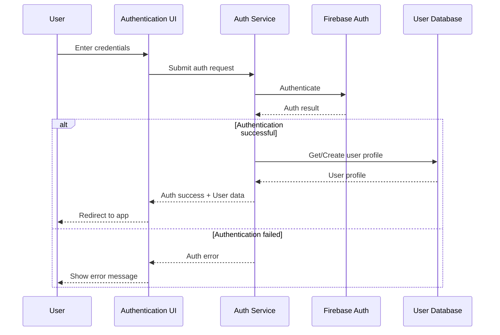

# Authentication Component

This document describes the Authentication component of the LorePin system.

## Overview

The Authentication component manages user authentication, authorization, and identity within the LorePin platform. It provides secure login, registration, and session management capabilities.

## Features

- Multiple authentication methods (email/password, social logins)
- User registration and account creation
- Password management (reset, change)
- Session management
- Role-based access control
- Security features (MFA, account recovery)

## Architecture

The Authentication component follows a layered architecture:

- **UI Layer**: Login/registration forms and authentication flows
- **Service Layer**: Authentication business logic
- **Provider Layer**: Integration with Firebase Authentication
- **Security Layer**: Authorization and access control

## Authentication Flow



## Data Model

```typescript
interface AuthUser {
  uid: string;
  email: string;
  emailVerified: boolean;
  displayName?: string;
  photoURL?: string;
  phoneNumber?: string;
  providerId: string;
  metadata: {
    creationTime: string;
    lastSignInTime: string;
  };
  providerData: {
    providerId: string;
    uid: string;
    displayName?: string;
    email?: string;
    phoneNumber?: string;
    photoURL?: string;
  }[];
}

interface UserClaims {
  admin?: boolean;
  sponsor?: boolean;
  moderator?: boolean;
  premiumMember?: boolean;
  emailVerified: boolean;
}
```

## API Reference

### Authentication

- `signInWithEmailPassword(email: string, password: string): Promise<UserCredential>`
- `signInWithGoogle(): Promise<UserCredential>`
- `signInWithFacebook(): Promise<UserCredential>`
- `signInWithInstagram(): Promise<UserCredential>`
- `signOut(): Promise<void>`
- `getCurrentUser(): User | null`

### Registration

- `createUserWithEmailPassword(email: string, password: string): Promise<UserCredential>`
- `sendEmailVerification(user: User): Promise<void>`
- `updateProfile(user: User, profile: { displayName?: string, photoURL?: string }): Promise<void>`

### Password Management

- `sendPasswordResetEmail(email: string): Promise<void>`
- `confirmPasswordReset(code: string, newPassword: string): Promise<void>`
- `updatePassword(user: User, newPassword: string): Promise<void>`

### Authorization

- `getUserClaims(user: User): Promise<UserClaims>`
- `hasPermission(user: User, permission: string): Promise<boolean>`
- `isAdmin(user: User): Promise<boolean>`
- `isSponsor(user: User): Promise<boolean>`

## Dependencies

- Firebase Authentication: For identity and authentication services
- User Profiles Component: For user profile management
- Notification Component: For authentication-related notifications

## Security Considerations

- All authentication requests use HTTPS
- Passwords are never stored in plaintext
- OAuth tokens are securely handled
- Rate limiting is applied to prevent brute force attacks
- Session tokens have appropriate expiration
- Custom claims are used for role-based access control

## Implementation Details

### Frontend Implementation

The Authentication component is implemented in the frontend using:

- React components for authentication UI
- Firebase Authentication SDK
- Context API for auth state management

```typescript
// Example auth context
const AuthContext = createContext<{
  currentUser: User | null;
  loading: boolean;
  signIn: (email: string, password: string) => Promise<UserCredential>;
  signOut: () => Promise<void>;
}>({
  currentUser: null,
  loading: true,
  signIn: () => Promise.reject(),
  signOut: () => Promise.reject(),
});
```

### Backend Implementation

The backend implementation uses:

- Firebase Authentication for identity management
- Cloud Functions for custom auth flows
- Firestore for storing additional user data
- Custom claims for role-based access

```typescript
// Example Cloud Function for setting custom claims
export const setUserClaims = functions.https.onCall(async (data, context) => {
  if (!context.auth) {
    throw new functions.https.HttpsError('unauthenticated', 'User must be authenticated');
  }
  
  if (!context.auth.token.admin) {
    throw new functions.https.HttpsError('permission-denied', 'Only admins can set user claims');
  }
  
  const { uid, claims } = data;
  await admin.auth().setCustomUserClaims(uid, claims);
  
  return { success: true };
});
```

## Testing

The Authentication component is tested using:

- Unit tests for authentication logic
- Integration tests for auth flows
- E2E tests for complete auth journeys
- Security testing for vulnerabilities

## Future Enhancements

- Multi-factor authentication
- Biometric authentication for mobile
- Single sign-on capabilities
- Enhanced security monitoring
- OAuth 2.0 provider capabilities