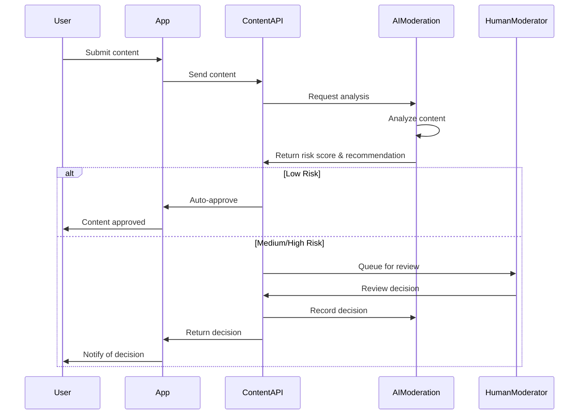

# LorePin AI-Driven Content Moderation

## Overview

This document outlines the AI-driven content moderation system for the LorePin Content Management System (CMS) v2.0. The system leverages multiple AI services and custom models to efficiently analyze and moderate user-generated content while maintaining high accuracy and ethical standards.

## Core Principles

1. **Accuracy**: Minimize false positives and false negatives through multi-layered analysis
2. **Transparency**: Provide clear explanations for moderation decisions
3. **Efficiency**: Automate routine moderation tasks while escalating edge cases to human moderators
4. **Ethics**: Ensure fairness, reduce bias, and respect cultural differences
5. **Continuous Improvement**: Learn from moderator decisions to improve over time

## Content Analysis Pipeline

### 1. Content Ingestion

#### 1.1 Content Types
- **Text**: Challenge descriptions, comments, user profiles
- **Images**: Submission photos, profile pictures
- **Video**: Submission videos, challenge demonstrations
- **Audio**: Voice notes, audio submissions

#### 1.2 Metadata Collection
- Content creator information (trust score, history)
- Content context (challenge type, location, time)
- Device and platform information
- Previous moderation decisions for similar content

### 2. Multi-Modal Analysis

#### 2.1 Text Analysis
- **OpenAI Moderation API**
  - Hate speech detection
  - Harassment and bullying identification
  - Self-harm content detection
  - Sexual content classification
  - Violence and graphic content detection
  
- **Custom NLP Models**
  - Sarcasm and cultural insensitivity detection
  - Brand safety analysis
  - Profanity detection with context awareness
  - Spam and scam identification
  - Sentiment analysis

#### 2.2 Image Analysis
- **Google Vision API**
  - Explicit content detection
  - Violence detection
  - Text extraction from images (for text moderation)
  - Object and scene recognition
  - Face detection (for privacy concerns)
  
- **Custom Computer Vision Models**
  - Brand and logo detection
  - Unsafe activity recognition
  - Location verification
  - Image manipulation detection
  - Cultural sensitivity analysis

#### 2.3 Video Analysis
- **AWS Rekognition**
  - Frame-by-frame explicit content detection
  - Object and scene recognition
  - Text detection in video
  - Face detection and analysis
  - Activity recognition
  
- **Custom Video Analysis**
  - Temporal analysis for context
  - Audio track analysis
  - Unsafe activity detection
  - Location and time verification
  - Video manipulation detection

#### 2.4 Audio Analysis
- **Speech-to-Text Services**
  - Transcription for text moderation
  - Speaker identification
  - Language detection
  
- **Audio Content Analysis**
  - Explicit language detection
  - Tone and sentiment analysis
  - Background noise analysis
  - Audio manipulation detection

### 3. Contextual Risk Scoring

#### 3.1 Risk Factors
- Content type and format
- Creator trust score and history
- Challenge context and requirements
- Location and time context
- Platform-specific policies
- Regional legal requirements

#### 3.2 Scoring Algorithm
```python
def calculate_risk_score(content, context, user_history):
    # Base score from content analysis
    base_score = content.explicit_score * 0.4 + content.violence_score * 0.3 + content.harassment_score * 0.3
    
    # Context multipliers
    context_multiplier = 1.0
    if context.is_sensitive_location:
        context_multiplier *= 1.2
    if context.is_night_time:
        context_multiplier *= 1.1
    if context.challenge_type == 'children_focused':
        context_multiplier *= 1.5
    
    # User history factor
    user_factor = 1.0
    if user_history.trust_score > 0.8:
        user_factor *= 0.8  # Trusted users get lower risk scores
    if user_history.previous_violations > 0:
        user_factor *= (1 + (user_history.previous_violations * 0.1))
    
    # Calculate final score (0-100)
    final_score = min(100, base_score * context_multiplier * user_factor)
    
    return final_score
```

#### 3.3 Risk Categories
- **Low Risk (0-30)**: Likely safe content, can be auto-approved
- **Medium Risk (31-70)**: Requires review, but not urgent
- **High Risk (71-90)**: Prioritized for human review
- **Critical Risk (91-100)**: Automatically held for review, may be auto-rejected

### 4. Decision Recommendation

#### 4.1 Recommendation Types
- **Approve**: Content meets all guidelines
- **Reject**: Content violates specific guidelines
- **Escalate**: Edge case requiring senior moderator review
- **Request Information**: Additional context needed from user

#### 4.2 Explanation Generation
- Specific policy violations identified
- Confidence scores for each violation
- Alternative suggestions for rejected content
- Educational information for users

#### 4.3 Decision Matrix
| Content Type | Risk Score | AI Confidence | Recommendation |
|--------------|------------|---------------|----------------|
| Any | 0-30 | >90% | Auto-approve |
| Any | 31-70 | >90% | Queue for review |
| Any | 71-90 | >90% | Prioritize for review |
| Any | 91-100 | >90% | Auto-reject or escalate |
| Any | Any | <70% | Escalate to human |
| Sensitive | Any | Any | Always human review |

## Feedback Loop System

### 1. Decision Recording

#### 1.1 Moderator Actions
- Accept or override AI recommendation
- Provide reason for override
- Add notes for edge cases
- Tag content for training data

#### 1.2 Data Collection
- AI recommendation vs. final decision
- Processing time for decision
- Moderator confidence rating
- User appeal information

### 2. Model Retraining

#### 2.1 Training Data Preparation
- Anonymization of sensitive data
- Balancing of training datasets
- Augmentation for underrepresented cases
- Validation set creation

#### 2.2 Retraining Schedule
- Weekly updates for threshold adjustments
- Monthly retraining for minor model improvements
- Quarterly deep retraining for major improvements
- Emergency retraining for critical issues

### 3. Performance Monitoring

#### 3.1 Key Metrics
- False positive rate
- False negative rate
- Average processing time
- Human intervention rate
- User appeal success rate

#### 3.2 Dashboards
- Real-time performance monitoring
- Trend analysis over time
- Comparison across content types
- Regional performance variations

## Ethical Considerations

### 1. Bias Mitigation

#### 1.1 Training Data Diversity
- Diverse content sources
- Multiple languages and dialects
- Various cultural contexts
- Different demographic groups

#### 1.2 Bias Detection
- Regular audits for demographic biases
- Cultural sensitivity reviews
- Regional policy compliance checks
- External ethics reviews

### 2. Transparency Measures

#### 2.1 User Communication
- Clear explanation of moderation decisions
- Educational resources about policies
- Appeal process information
- Transparency reports

#### 2.2 Internal Transparency
- Decision audit trails
- AI confidence metrics
- Override justifications
- Performance analytics

### 3. Human Oversight

#### 3.1 Escalation Paths
- Junior to senior moderator escalation
- Regional to global policy expert escalation
- Technical to ethics committee escalation
- Legal compliance review process

#### 3.2 Review Committees
- Ethics review board
- Cultural sensitivity panel
- Legal compliance team
- Technical oversight committee

## Implementation Architecture

### 1. System Components

#### 1.1 Content Analysis Service
- Microservice architecture
- Scalable processing queue
- Multi-modal analysis orchestration
- Result aggregation and normalization

#### 1.2 Decision Engine
- Rule-based preliminary decisions
- ML-based recommendation system
- Explanation generator
- Confidence calculator

#### 1.3 Feedback Processor
- Decision recording system
- Training data collector
- Performance analytics
- Model retraining orchestrator

### 2. Integration Points

#### 2.1 Content Submission Flow


#### 2.2 API Interfaces
- Content submission API
- Analysis request API
- Decision recommendation API
- Feedback collection API
- Performance metrics API

### 3. Deployment Strategy

#### 3.1 Infrastructure
- Containerized microservices
- Auto-scaling based on queue size
- GPU acceleration for ML models
- Global distribution for low latency

#### 3.2 Monitoring and Alerting
- Real-time performance monitoring
- Anomaly detection for model drift
- Alert thresholds for key metrics
- On-call rotation for critical issues

## Success Metrics

### 1. Accuracy Metrics
- False positive rate < 5%
- False negative rate < 1%
- Human override rate < 10%
- Appeal success rate < 5%

### 2. Efficiency Metrics
- Average processing time < 500ms
- Auto-approval rate > 70%
- Human moderator productivity +50%
- Queue backlog < 30 minutes

### 3. User Experience Metrics
- Moderation transparency rating > 4.5/5
- Appeal resolution time < 24 hours
- Educational resource engagement > 30%
- User satisfaction with moderation > 80%

## Related Documentation
- [CMS Specifications](./cms-specifications.md)
- [CMS Implementation Plan](./cms-implementation-plan.md)
- [CMS Database Schema](./cms-database-schema.md)
- [Technical Architecture](../../02-architecture/technical-architecture.md)

## Conclusion

The AI-driven content moderation system provides a scalable, accurate, and ethical approach to content moderation for the LorePin platform. By combining multiple AI services with human oversight and continuous improvement, the system can efficiently handle large volumes of user-generated content while maintaining high standards of accuracy and fairness. The focus on transparency and ethics ensures that moderation decisions are explainable and unbiased, building trust with users and content creators. 