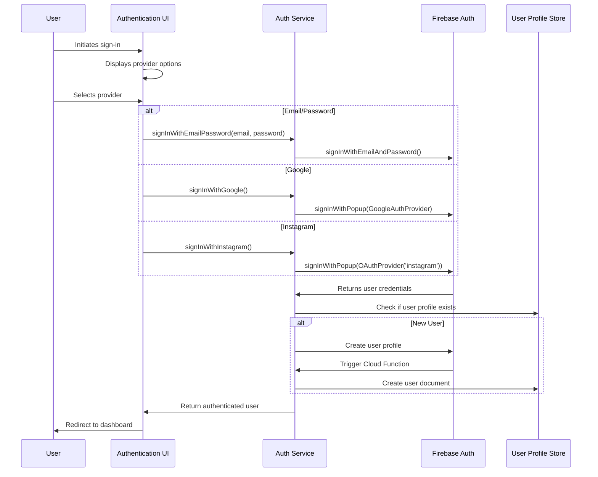

# Authentication Component

## Overview

The Authentication component in LorePin handles user authentication, authorization, and session management. It provides a secure and seamless authentication experience using multiple providers (Google, Email/Password, and Instagram) while maintaining a consistent user identity across the platform.

## Architecture

The Authentication component follows a layered architecture:

1. **UI Layer**: Authentication forms and screens
2. **Service Layer**: Authentication logic and provider integration
3. **API Layer**: Firebase Authentication integration
4. **Storage Layer**: User profile data in Firestore

### Authentication Flow Diagram



## Implementation

### Frontend Implementation

#### Web (React)

The web implementation uses React with Firebase Authentication:

```typescript
// src/components/auth/AuthProvider.tsx
import { createContext, useContext, useEffect, useState } from 'react';
import { 
  getAuth, 
  signInWithEmailAndPassword, 
  signInWithPopup, 
  GoogleAuthProvider,
  OAuthProvider,
  createUserWithEmailAndPassword,
  signOut,
  onAuthStateChanged,
  User
} from 'firebase/auth';
import { doc, getDoc, setDoc } from 'firebase/firestore';
import { db } from '../../firebase/config';

// Context and hook implementation
export const AuthContext = createContext<AuthContextType | null>(null);

export const useAuth = () => {
  const context = useContext(AuthContext);
  if (!context) {
    throw new Error('useAuth must be used within an AuthProvider');
  }
  return context;
};

// Provider component
export const AuthProvider: React.FC = ({ children }) => {
  const [currentUser, setCurrentUser] = useState<User | null>(null);
  const [loading, setLoading] = useState(true);
  const auth = getAuth();
  
  // Authentication methods
  const signInWithEmail = async (email: string, password: string) => {
    return signInWithEmailAndPassword(auth, email, password);
  };
  
  const signInWithGoogle = async () => {
    const provider = new GoogleAuthProvider();
    return signInWithPopup(auth, provider);
  };
  
  const signInWithInstagram = async () => {
    const provider = new OAuthProvider('instagram.com');
    return signInWithPopup(auth, provider);
  };
  
  // User profile management
  const createUserProfile = async (user: User) => {
    const userRef = doc(db, 'users', user.uid);
    const userSnap = await getDoc(userRef);
    
    if (!userSnap.exists()) {
      await setDoc(userRef, {
        userId: user.uid,
        email: user.email,
        displayName: user.displayName || '',
        photoURL: user.photoURL || '',
        createdAt: new Date(),
        skills: [],
        followers: [],
        loreCoins: 0
      });
    }
  };
  
  // Auth state listener
  useEffect(() => {
    const unsubscribe = onAuthStateChanged(auth, async (user) => {
      setCurrentUser(user);
      if (user) {
        await createUserProfile(user);
      }
      setLoading(false);
    });
    
    return unsubscribe;
  }, []);
  
  const value = {
    currentUser,
    signInWithEmail,
    signInWithGoogle,
    signInWithInstagram,
    signOut: () => signOut(auth),
    loading
  };
  
  return (
    <AuthContext.Provider value={value}>
      {!loading && children}
    </AuthContext.Provider>
  );
};
```

#### Mobile (Flutter)

The mobile implementation uses Flutter with Firebase Authentication:

```dart
// lib/services/auth_service.dart
import 'package:firebase_auth/firebase_auth.dart';
import 'package:cloud_firestore/cloud_firestore.dart';
import 'package:google_sign_in/google_sign_in.dart';
import 'package:flutter_facebook_auth/flutter_facebook_auth.dart';

class AuthService {
  final FirebaseAuth _auth = FirebaseAuth.instance;
  final FirebaseFirestore _firestore = FirebaseFirestore.instance;
  
  // Get current user
  User? get currentUser => _auth.currentUser;
  
  // Auth state changes stream
  Stream<User?> get authStateChanges => _auth.authStateChanges();
  
  // Sign in with email and password
  Future<UserCredential> signInWithEmail(String email, String password) {
    return _auth.signInWithEmailAndPassword(
      email: email,
      password: password,
    );
  }
  
  // Sign in with Google
  Future<UserCredential> signInWithGoogle() async {
    final GoogleSignInAccount? googleUser = await GoogleSignIn().signIn();
    final GoogleSignInAuthentication googleAuth = await googleUser!.authentication;
    
    final credential = GoogleAuthProvider.credential(
      accessToken: googleAuth.accessToken,
      idToken: googleAuth.idToken,
    );
    
    return _auth.signInWithCredential(credential);
  }
  
  // Sign in with Instagram (via Facebook)
  Future<UserCredential> signInWithInstagram() async {
    final LoginResult result = await FacebookAuth.instance.login();
    
    final OAuthCredential credential = 
        FacebookAuthProvider.credential(result.accessToken!.token);
        
    return _auth.signInWithCredential(credential);
  }
  
  // Create user profile
  Future<void> createUserProfile(User user) async {
    final userRef = _firestore.collection('users').doc(user.uid);
    final userDoc = await userRef.get();
    
    if (!userDoc.exists) {
      await userRef.set({
        'userId': user.uid,
        'email': user.email,
        'displayName': user.displayName ?? '',
        'photoURL': user.photoURL ?? '',
        'createdAt': FieldValue.serverTimestamp(),
        'skills': [],
        'followers': [],
        'loreCoins': 0
      });
    }
  }
  
  // Sign out
  Future<void> signOut() {
    return _auth.signOut();
  }
}
```

### Backend Implementation

The backend uses Firebase Cloud Functions to handle user creation and profile management:

```typescript
// functions/src/auth/createUserProfile.ts
import * as functions from 'firebase-functions';
import * as admin from 'firebase-admin';

/**
 * Cloud Function triggered when a new user is created in Firebase Auth
 * Creates a user profile document in Firestore
 */
export const createUserProfile = functions.auth.user().onCreate(async (user) => {
  const { uid, email, displayName, photoURL } = user;
  
  try {
    // Create user document in Firestore
    const userRef = admin.firestore().collection('users').doc(uid);
    
    // Check if user already exists
    const userDoc = await userRef.get();
    if (userDoc.exists) {
      console.log(`User ${uid} already has a profile`);
      return null;
    }
    
    // Create new user profile
    const userData = {
      userId: uid,
      email: email || '',
      displayName: displayName || '',
      photoURL: photoURL || '',
      createdAt: admin.firestore.FieldValue.serverTimestamp(),
      skills: [],
      followers: [],
      loreCoins: 0,
      lastActive: admin.firestore.FieldValue.serverTimestamp()
    };
    
    await userRef.set(userData);
    console.log(`Created new user profile for ${uid}`);
    
    return userData;
  } catch (error) {
    console.error('Error creating user profile:', error);
    throw error;
  }
});
```

## API Reference

### Frontend Auth Service API

| Method | Description | Parameters | Returns |
|--------|-------------|------------|---------|
| `signInWithEmail` | Sign in with email/password | `email: string, password: string` | `Promise<UserCredential>` |
| `signInWithGoogle` | Sign in with Google | None | `Promise<UserCredential>` |
| `signInWithInstagram` | Sign in with Instagram | None | `Promise<UserCredential>` |
| `signOut` | Sign out current user | None | `Promise<void>` |
| `createUserProfile` | Create user profile in Firestore | `user: User` | `Promise<void>` |

### Backend Cloud Functions

| Function | Trigger | Description |
|----------|---------|-------------|
| `createUserProfile` | `functions.auth.user().onCreate` | Creates a user profile when a new user signs up |
| `deleteUserData` | `functions.auth.user().onDelete` | Cleans up user data when account is deleted |

## Usage Examples

### Sign In with Email/Password

```tsx
// React component example
import { useAuth } from '../context/AuthContext';

const SignInForm = () => {
  const [email, setEmail] = useState('');
  const [password, setPassword] = useState('');
  const [error, setError] = useState('');
  const { signInWithEmail } = useAuth();
  
  const handleSubmit = async (e) => {
    e.preventDefault();
    setError('');
    
    try {
      await signInWithEmail(email, password);
      // Redirect or show success
    } catch (err) {
      setError('Failed to sign in: ' + err.message);
    }
  };
  
  return (
    <form onSubmit={handleSubmit}>
      <input 
        type="email" 
        value={email} 
        onChange={(e) => setEmail(e.target.value)} 
        placeholder="Email" 
        required 
      />
      <input 
        type="password" 
        value={password} 
        onChange={(e) => setPassword(e.target.value)} 
        placeholder="Password" 
        required 
      />
      {error && <p className="error">{error}</p>}
      <button type="submit">Sign In</button>
    </form>
  );
};
```

### Social Sign In Buttons

```tsx
// React component example
import { useAuth } from '../context/AuthContext';

const SocialSignIn = () => {
  const [error, setError] = useState('');
  const { signInWithGoogle, signInWithInstagram } = useAuth();
  
  const handleGoogleSignIn = async () => {
    setError('');
    try {
      await signInWithGoogle();
      // Redirect or show success
    } catch (err) {
      setError('Failed to sign in with Google: ' + err.message);
    }
  };
  
  const handleInstagramSignIn = async () => {
    setError('');
    try {
      await signInWithInstagram();
      // Redirect or show success
    } catch (err) {
      setError('Failed to sign in with Instagram: ' + err.message);
    }
  };
  
  return (
    <div className="social-signin">
      <button onClick={handleGoogleSignIn} className="google-btn">
        Sign in with Google
      </button>
      <button onClick={handleInstagramSignIn} className="instagram-btn">
        Sign in with Instagram
      </button>
      {error && <p className="error">{error}</p>}
    </div>
  );
};
```

## Testing

### Unit Testing

```typescript
// Example Jest test for AuthProvider
import { render, screen, fireEvent, waitFor } from '@testing-library/react';
import { AuthProvider, useAuth } from '../AuthProvider';
import { signInWithEmailAndPassword } from 'firebase/auth';

// Mock Firebase
jest.mock('firebase/auth', () => ({
  getAuth: jest.fn(),
  signInWithEmailAndPassword: jest.fn(),
  signInWithPopup: jest.fn(),
  onAuthStateChanged: jest.fn(),
  GoogleAuthProvider: jest.fn(),
  OAuthProvider: jest.fn()
}));

describe('AuthProvider', () => {
  test('signInWithEmail calls Firebase signInWithEmailAndPassword', async () => {
    const mockSignIn = signInWithEmailAndPassword as jest.Mock;
    mockSignIn.mockResolvedValueOnce({ user: { uid: '123' } });
    
    const TestComponent = () => {
      const { signInWithEmail } = useAuth();
      
      const handleClick = () => {
        signInWithEmail('test@example.com', 'password123');
      };
      
      return <button onClick={handleClick}>Sign In</button>;
    };
    
    render(
      <AuthProvider>
        <TestComponent />
      </AuthProvider>
    );
    
    fireEvent.click(screen.getByText('Sign In'));
    
    await waitFor(() => {
      expect(mockSignIn).toHaveBeenCalledWith(
        expect.anything(),
        'test@example.com',
        'password123'
      );
    });
  });
});
```

### Integration Testing

```typescript
// Example Cypress test for authentication flow
describe('Authentication Flow', () => {
  beforeEach(() => {
    cy.visit('/login');
  });
  
  it('should sign in with email and password', () => {
    cy.get('input[type="email"]').type('test@example.com');
    cy.get('input[type="password"]').type('password123');
    cy.get('button[type="submit"]').click();
    
    // Assert redirect to dashboard
    cy.url().should('include', '/dashboard');
    cy.get('[data-testid="user-greeting"]').should('contain', 'Welcome');
  });
  
  it('should show error message for invalid credentials', () => {
    cy.get('input[type="email"]').type('invalid@example.com');
    cy.get('input[type="password"]').type('wrongpassword');
    cy.get('button[type="submit"]').click();
    
    cy.get('.error').should('be.visible');
    cy.url().should('include', '/login');
  });
});
```

## Troubleshooting

### Common Issues

#### 1. Social Sign-In Popup Blocked

**Problem**: The social sign-in popup is blocked by the browser.

**Solution**:
- Ensure the sign-in function is triggered by a user action (click)
- Add instructions for users to allow popups
- Consider using redirect method instead of popup for mobile devices

```typescript
// Using redirect instead of popup for mobile
const isMobile = /Android|webOS|iPhone|iPad|iPod|BlackBerry|IEMobile|Opera Mini/i.test(navigator.userAgent);

const signInWithGoogle = async () => {
  const provider = new GoogleAuthProvider();
  
  if (isMobile) {
    return signInWithRedirect(auth, provider);
  } else {
    return signInWithPopup(auth, provider);
  }
};
```

#### 2. User Profile Not Created

**Problem**: User authenticates but profile is not created in Firestore.

**Solution**:
- Check Cloud Function logs for errors
- Verify Firebase Authentication triggers are properly set up
- Ensure Firestore security rules allow profile creation

#### 3. Session Persistence Issues

**Problem**: User is logged out unexpectedly.

**Solution**:
- Configure persistence settings in Firebase:

```typescript
// Set persistence to LOCAL (default), SESSION, or NONE
import { setPersistence, browserLocalPersistence } from 'firebase/auth';

setPersistence(auth, browserLocalPersistence);
```

## Future Improvements

1. **Multi-factor Authentication**: Add support for 2FA using SMS or authenticator apps
2. **Password Recovery Flow**: Enhance the password recovery process with better UX
3. **Session Management**: Add ability to view and manage active sessions
4. **Account Linking**: Allow users to link multiple authentication providers to one account
5. **Progressive Profiling**: Collect user information gradually instead of all at once
6. **Biometric Authentication**: Add support for fingerprint/face recognition on mobile devices
7. **Compliance Features**: Add GDPR and CCPA compliance features for user data management